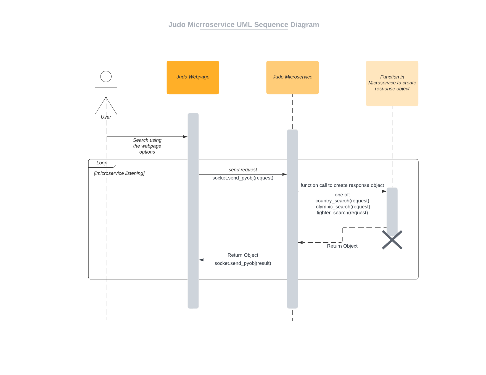

# CS-361
Software Engineering 1

Microservice

*****************************************************************************************
How to REQUEST and RECIEVE data from the microservice:
  here is an example of the structure required to make and recieve the requests:
  
import zmq  
context = zmq.Context()

#  Socket to talk to server  
print("Connecting to server…")  
socket = context.socket(zmq.REQ)  
socket.connect("tcp://localhost:5555")  

#  request and wait for a response  
print(f"Sending request…")  
socket.send_pyobj(**REQUEST**)  

#  Get the reply   
message = socket.recv_pyobj()  
print(f"Received reply!")  
print(message)  

*****************************************************************************************
There are three **REQUEST** formats supported:  
  
  **Country search.**  
  to request judo data related to a country the request must be in the form:  
  {"country": "some conuntry"}  
  eg:  
  socket.send_pyobj({"country": "Japan"})  
  note: the country is case insensitive so "japan" or "Japan" will work.  
    
  **Olympic year search.**  
  to request judo data related to a specific olympic year the request must be in the form:  
  {"olympic": "some year"}  
  eg:  
  socket.send_pyobj({"olympic": "2020"})  
    
  **Fighter search.**  
  to request judo data related to a specific fighter the request must be in the form:  
  {"sex": "Men/Women", "category": "some category", "origin": "some country"}  
  eg:  
  socket.send_pyobj({"sex": "Men", "category": "Lightweight", "origin": "Japan"})  
     
  notes:  
  For "sex" the input must be "Men", "Women" or None  
    
  For "category" the input must be one of the following:  
          "Extra Lightweight",  
          "Half Lightweight",  
          "Lightweight",  
          "Half Middleweight",  
          "Middleweight",  
          "Half Heavyweight",  
          "Heavyweight",  
          "Open Class",  
          None  
            
   For "origin" the input must be None or any country with the first letter of every word capitalized eg: "United States", "Soviet Union", "Japan".  

*****************************************************************************************
When **RECIEVING** data, the data will be formated as follows:  
  **Country search.**  
  
    [{'name': 'Antoine Valois-Fortier', 
    'sex': 'Men',
    'class': 'Half Middleweight',
    'medal': 'Bronze',
    'year': '2012',
    'city': 'London'}, 
    .
    .
    .
    {'name': 'Catherine Beauchemin-Pinard', 
    'sex': 'Women', 
    'class': 'Half Middleweight', 
    'medal': 'Bronze', 
    'year': '2020', 
    'city': 'Tokyo'}]

    

  **Olympic year search.**  
 
    [{'city': 'Tokyo'},
    
    {'category': 'Extra Lightweight',
    'sex': 'Men',
    'Gold': ['Naohisa Takato ', 'Japan'],
    'Silver': ['Yang Yung-wei ', 'Chinese Taipei'],
    'Bronze': ['Luka Mkheidze ', 'France'],
    'Bronze2': ['Yeldos Smetov ', 'Kazakhstan']},
    .
    .
    .
    {'category': 'Heavyweight',
    'sex': 'Women',
    'Gold': ['Akira Sone ', 'Japan'],
    'Silver': ['Idalys Ortiz ', 'Cuba'],
    'Bronze': ['Iryna Kindzerska ', 'Azerbaijan'],
    'Bronze2': ['Romane Dicko ', 'France']}]

  
  **Fighter search.**  
  
    [{'name': 'Jessica Klimkait ',
    'origin': 'Canada',
    'sex': 'Women',
    'gold': [],
    'silver': [],
    'bronze': ['2020 Tokyo - Lightweight']},
    .
    .
    .
    {'name': 'Catherine Beauchemin-Pinard ',
    'origin': 'Canada',
    'sex': 'Women',
    'gold': ['2020 Tokyo - Half Middleweight'],
    'silver': [],
    'bronze': []}]
    
*****************************************************************************************

